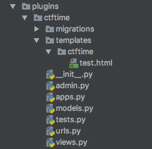

# Plugins

Since django use <i>apps</i>, plugins are easy nice addition to bCTF, which comes with CTFTime plugin as an example.
CTFTime plugin is used to create scoreboard with minimal and maximal information, and exporting ability in order
to send data over to https://ctftime.org for statistics. Because it's simple in design, it's a great example
for developing your own plugins.

## Developing

You should start by changing directory into bctf/plugins and creating new django app with:

    django-admin startapp my_plugin
    
This will create an app in plugins folder, with name my_plugin and file structure for an app.

### - Urls.py
You should at minimal add file urls.py into app directory. Taken from ctftime plugin, this is content of this file:

    from django.urls import path
    from plugins.ctftime.views import CTFTimeView
    
    app_name = 'ctftime'
    urlpatterns = [
        path('', CTFTimeView.as_view(), name='ctftime'),
    ]

This defines urls your plugin is going to use.
When loaded, plugin urls are prepended to apps name. In this case, ctftime plugin can be foudn at /ctftime/ url.

URLS are loaded automatically when bCTF starts, which means you'll have to restart bCTF when you make changes to urls.py.
And also, URLS for plugins are loaded on top ( first), this way it's you can override existing URLS.
Say you want to override challenges URLS, you will need to create app named 'challenges', and in urls.py you can define something like.

    from django.urls import path
    from plugins.challenges.views import CTFTimeView
    
    app_name = 'challenges'
    urlpatterns = [
        path('', CustomChallenges.as_view(), name='challenges'),
    ]
   
And it will override existing implementation.

### - Templates

In order to use templates, and bCTF to serve theme create 'templates' directory in your plugin app root directory,
and inside that directory create a folder with your plugin name.

For example check CTFTime plugin structure:

### - Testing

Tests should be defined in tests.py file. If you are planing to send a plugin as contrib so other people can use it,
it's good idea to included tests, at least to check your core login in your plugin.

### - Views, models, and other...

Everything else is just a standard django app, and it can be defined in standard locations:
* views - in views.py
* models - in models.py

...