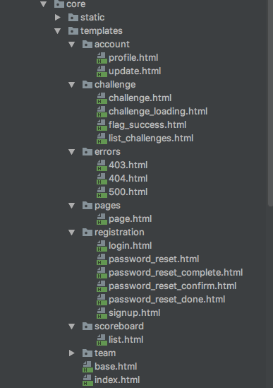

# Themes

bCTF comes with 4 predefined themes, which can be used out of box. Those are: core, light, minimal and l33t.
You can find them when you log as administrator and go to admin panel -> CTF Settings.
Default one is, take a really wild guess, core.

## Installing themes

If you have a custom created theme, or found one on the interwebs installation is dead simple:
Just copy/paste it into themes/ directory in bctf/bctf/themes/ directory and that's it!
When you refresh CTF Settings page, you will see your new theme in dropdown list.

For user contributed themes you can check [here](https://b-ctf.io/themes/).

## Developing themes

For developing your own themes, you must keep the same file structure and names as present in for any of
themes that come out of box ( core, light ...), so django can find and load template with corresponding name.

This is structure for theme core:

* static/ - This directory holds all static files, like JavaScript, CSS, images and all other assets, and you can 
structure them as you like. Keeping file structure does not apply here.

* templates/ - This holds all of django templates, and names must stay the same. If you want to split 
one template into multiple components, for example challenge.html, you still have to create challange.html template, but you can then create additional challenge_something.html and include it in the original challenge.html with  tag.

## Preparing for production

After you are done creating your custom theme good practice and sanity check is to run tests.
This way you will ensure that all core functionalities of the application are working. If you changed some 
template in a way that i doesn't show what it was supposed to ( e.g. scoreboard now showing challenges, for whatever reason),
you will likely get errors when tests are done. One way around this is to selectivly run tests per apps.
You can do this by specifying app name in a test run, for example:

    python3 manage.py test apps.pages
   
This way django will only run tests for pages.

## Contribution ( Opensourcing your theme)

If you want to contribute your custom style to the opensource theme base, you can do it by sending a PR
to the themes repository, or sending it via email/contact.
Just make sure that you set some open license (MIT, BSD or apache for example).